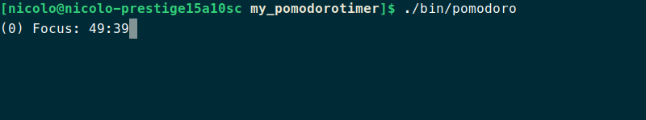
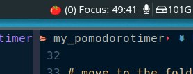

# my_pomodorotimer
### Why another version of the pomodoro timer?
This is an easy to use version of the famous pomodoro timer. My aim is to write a C++ executable for myself, I don't like all the web versions and the community based versions. I need something that works offline and with the following functionalities:
- long and short breaks
- keeps track of the timers executed in the present day and if I switch off and on the laptop the counter for the day is NOT resetted
- i3 block integration (future idea)

Instead of looking around the internet for days I decided to write it on my own. 

What is obtained is the following



### Naive usage
To see the help page just use:
```
./bin/pomodoro -h
```

### start script + i3 integration
i3 integration if not need can be ignored completly, the scrip works in any case.
Below is written a basic start script for the timer, place the script in the same folder of the make file and then use it to start the timer: 
```
#!/usr/bin/env bash

#assign usefull variables
TERMINAL=alacritty # terminal in you system

S_BREAK=10 # short break duration (minutes)
L_BREAK=20 # long break duration (minutes)
TIMER=50 # timer duration (minutes)
N_BREAKS=3 # number of consecutive short breaks

# obtain where the scrit is
SCRIPT_DIR=$( cd -- "$( dirname -- "${BASH_SOURCE[0]}" )" &> /dev/null && pwd )

# move to the folder where me have files
cd ${SCRIPT_DIR}

# open terminal changing class
${TERMINAL} -e ./bin/pomodoro -b $S_BREAK -B $L_BREAK -t $TIMER -s $N_BREAKS

# from here here only for i3 users
# delate notify.txt so the notify  is not shows in i3
rm ./files/notify.txt
```

To use it modify the "TERMINAL" variable with your terminal emulator name, in the example I wrote alacritty.
The script simply open a new terminal in the proper directory and run there the pomodoro executable with default settings, then to close it use CRTL+C.
If you want to modify the default values just change the variables at the beginning of the scrip.

#### i3 integration
First of all the final result:



Having a small timer on the i3 status bar in my opinion is helpful. In my case, I use i3blocks, but the concept applies to all bars. The script updates a file named "notify.txt" in the "files" folder every second. To show to countdown in the bar I added a basic block to i3blocks.conf, as shown below.
```
[pomotimer]
command=cat /path_to_your_folder/files/notify.txt
#emoji from font: noto color emoji
label=🍅 
interval=1
```
This simply dumps in the bar what is written inside notify.txt every second with a pomodoro icon (the icon is from the noto color emoji font)


#### External sources
- the audio used for the bell is from [this](https://mixkit.co/free-sound-effects/bell/) website 
